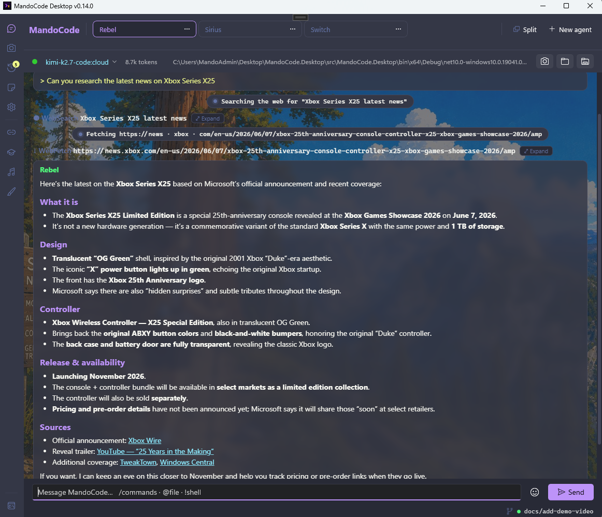
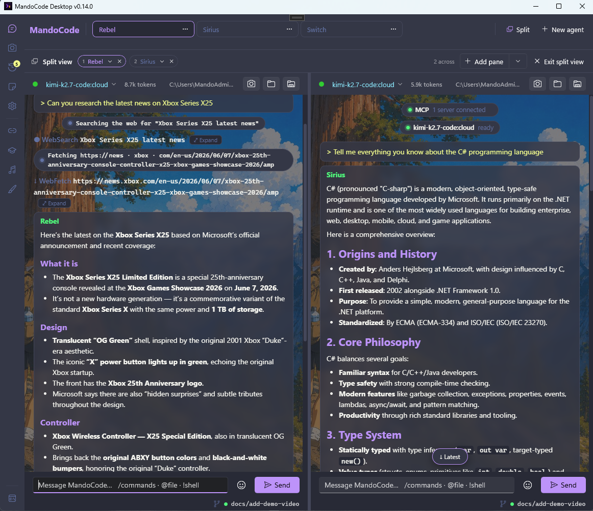
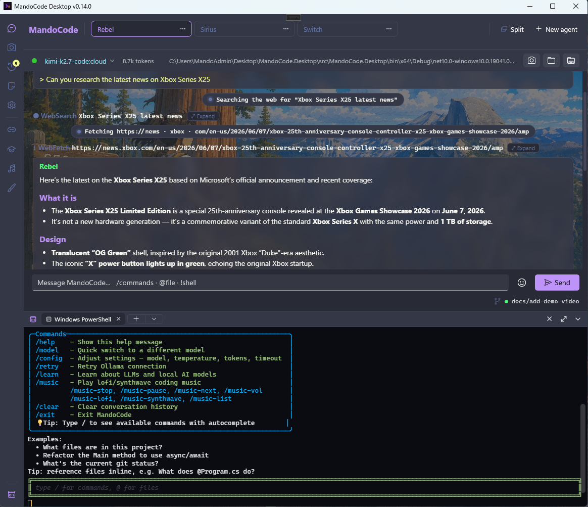
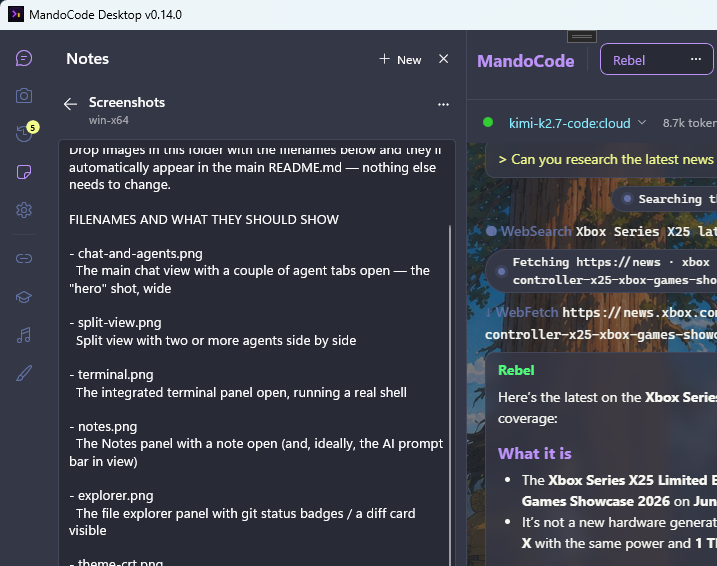
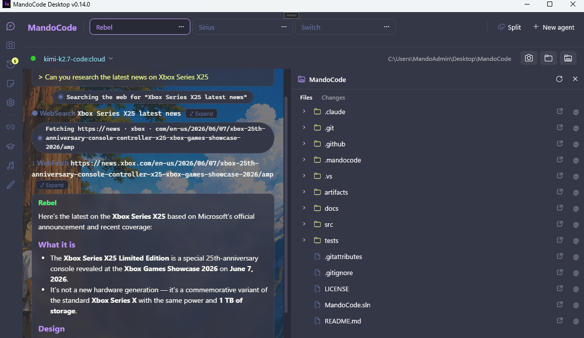
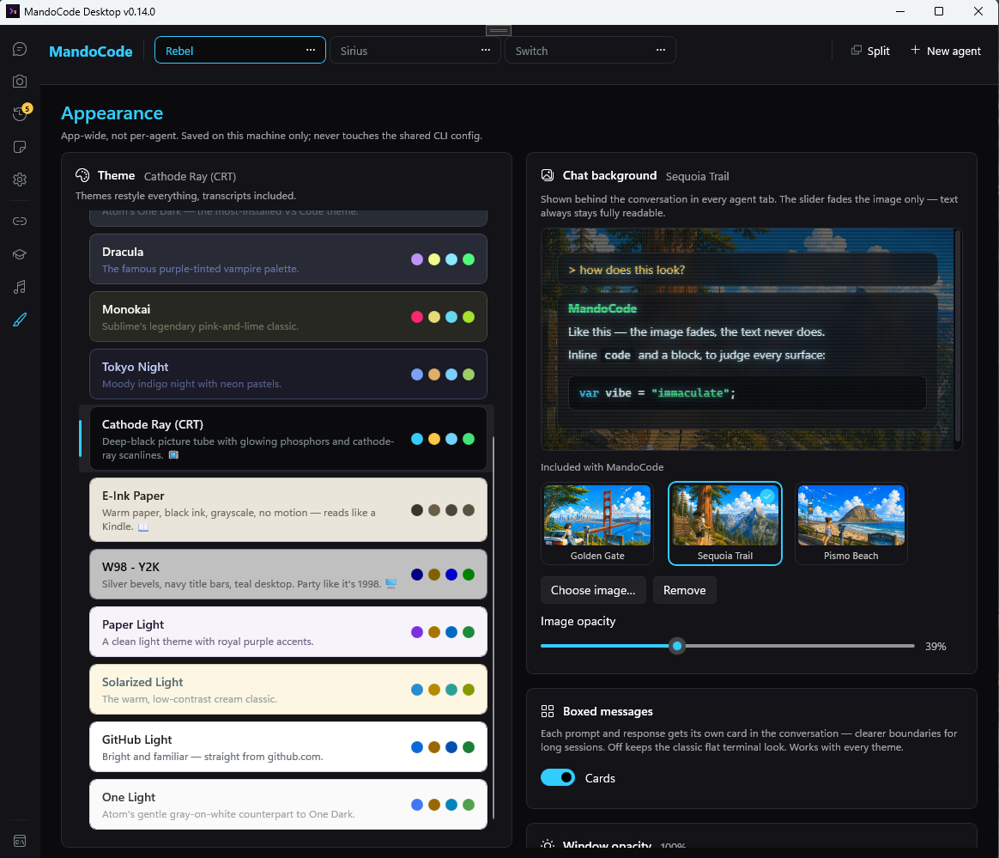
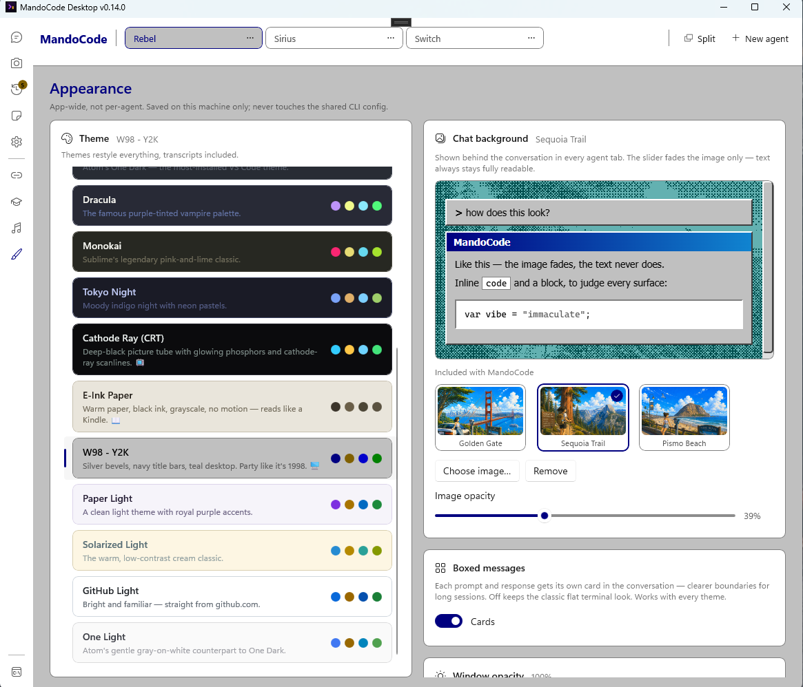

<h1 align="center">MandoCode Desktop</h1>
<p align="center"><b>An AI coding assistant built on open-weight models, not someone else's closed one.</b></p>

<p align="center">
  <a href="https://github.com/DevMando/MandoCode.Desktop/releases"></a>
  <a href="#license"></a>
  
  <a href="https://ollama.com"></a>
  <a href="https://github.com/DevMando/MandoCode"></a>
</p>

---

Most AI coding tools lock you into one vendor's closed model — whatever they ship, whenever they
change it, on their terms. MandoCode runs on open-weight models instead, through
[Ollama](https://ollama.com): entirely on your own machine — free, private, no API key, nothing
metered per token — or a hosted model when you want more headroom. Same assistant either way, same
conversation, your call.

MandoCode Desktop takes that assistant and gives it an actual home on Windows, instead of a single
chat window bolted onto a terminal: several agents working in parallel, a real integrated shell, a
git-aware file browser, a notes pad, and enough personality in the theming that it doesn't have to
look like every other dev tool on your taskbar.

It's built on the exact same engine as the [MandoCode CLI](https://github.com/DevMando/MandoCode) —
literally the same code, pinned in as a submodule — so nothing about how it thinks is different.
Only the interface is.

https://github.com/user-attachments/assets/fba824e2-c86f-4999-a13f-0174ed23de72

<p align="center">
  
</p>

<table>
<tr>
<td width="50%"></td>
<td width="50%"></td>
</tr>
<tr>
<td width="50%"></td>
<td width="50%"></td>
</tr>
<tr>
<td width="50%"></td>
<td width="50%"></td>
</tr>
</table>

## Why it exists

Two problems, one app:

- **Open models, your choice — never one vendor's.** MandoCode runs on open-weight models through
  Ollama: swap models per agent, run one entirely on your own hardware for free, or reach for a
  hosted model when you want more ceiling. You're never locked to a single closed API.
- **A coding assistant is something you live in all day, not a popup.** So it gets a real native
  app built on C#, WinUI 3, and Microsoft's Agent Framework over Ollama — multiple agents open at once,
  a real shell, a file tree that actually knows about git, a place to jot down a thought without
  opening a text editor, and a look you can make your own instead of one fixed dark theme.

## Features

- **Agent tabs, and Split view for up to four at once** — each tab is its own independent
  conversation, project folder, and model. Split view puts two, three, or four side by side so you
  can watch several agents work in parallel instead of babysitting one at a time.
- **A real integrated terminal** — PowerShell 7, Windows PowerShell, cmd, Git Bash, or WSL, running
  as an actual shell (not a fake console), opened in the active agent's project folder.
- **Git-aware file explorer** — a live file tree with branch, status, and dirty badges, inline diff
  cards, one-click commit, and drag-to-reference straight into the chat.
- **Context snapshots & session history** — closing an agent archives its conversation instead of
  deleting it; reopen any past conversation later with its transcript and, when the model supports
  it, its full memory. Snapshots let you carry an AI-written recap of one conversation into a
  completely different model or a fresh agent.
- **Notes** — an always-there jot pad, separate from any project, with optional AI help. The
  assistant has no file tools here at all — the only way a reply reaches your note is a button you
  press, so nothing gets written without you.
- **Skills & MCP** — teach the assistant new, reusable capabilities (install one from a folder or a
  zip, or have it write its own), and connect external tools over MCP.
- **16 built-in themes** — from Dracula, Tokyo Night, and One Dark Pro to a genuinely period-correct
  Windows 98 desktop and a flickering Cathode Ray CRT tube, plus your own background image behind
  the chat.
- **A tiny built-in music player** — lofi and synthwave come bundled, or point it at any folder of
  your own MP3s.
- **Guided first-run setup** — on first launch it finds (or installs) Ollama for you and helps you
  pick a starter model, right in the chat. No config file to hand-edit before you can say hello.

## Install (no build needed)

Download the latest `MandoCode.Desktop-*-win-x64.zip` from
[Releases](https://github.com/DevMando/MandoCode.Desktop/releases), extract it anywhere, and run
`MandoCode.Desktop.exe`. The zip is fully self-contained — **no .NET install required**.

On first launch the app runs a guided setup right in the chat: it finds Ollama (offering to
install it via winget if it's missing), starts the daemon, and helps you pick a first model — a
cloud model (best quality, no GPU needed, free ollama.com sign-in) or a local one from a short
list with size and hardware hints. Re-run the wizard any time with `/setup` or the **Run guided
setup** button in Settings.

Requirements: Windows 10 (1809+) or Windows 11, with the WebView2 runtime — preinstalled on
Windows 11 and kept current by Edge on Windows 10.

## Build from source

```
git clone --recursive https://github.com/DevMando/MandoCode.Desktop.git
cd MandoCode.Desktop
dotnet build src/MandoCode.Desktop/MandoCode.Desktop.csproj
dotnet run --project src/MandoCode.Desktop
```

Already cloned without `--recursive`? The `MandoCode/` folder will be empty — run
`git submodule update --init` and build again.

`MandoCode.Desktop.exe <folder>` opens with that folder as the project root (otherwise the current
directory; changeable in-app via the folder button). Requires a reachable Ollama (`ollama serve`).
Uses the same config file as the CLI, so both apps share endpoint/model/settings.

## Under the hood

MandoCode Desktop reuses the CLI's entire harness — the AI service, task planner, plugins, MCP,
skills, config, approvals, token tracking — as a pinned git submodule. Only the interface layer
(agents, split view, the terminal, notes, theming, and everything else that makes this a native app
rather than a console) is new. If you want the deep dive — how the harness submodule is pinned and
rolled forward, how agents and split view are wired, how snapshots/notes/history actually persist —
see **[docs/ARCHITECTURE.md](docs/ARCHITECTURE.md)**.

## License

MIT — Armando Fernandez - DevMando.
